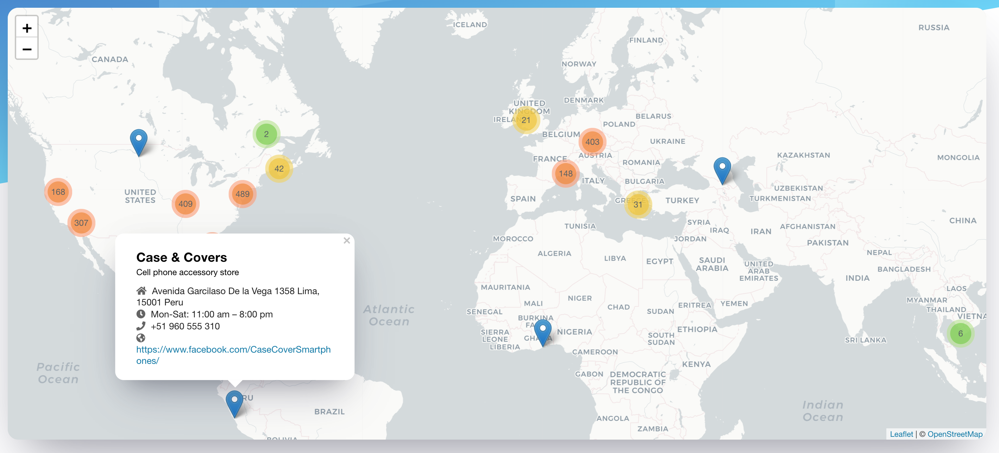

# Open-Source Bitcoin ATM Locator

Add your local Bitcoin ATM in geoJSON format

The repository is seperated into 5 map regions: Asia, Europe, North America, South America, and Africa.

Here is an example of Bitcoin ATM in Australia
```
{
      "type": "Feature",
      "properties": {
        "name": "The Glen Shopping Centre",
        "description": "Shopping mall",
        "address": "235 Springvale Rd Glen Waverley, VIC 3150 Australia",
        "hours": "Mon-Wed: 9:00 am – 5:30 pm\nThu-Fri: 9:00 am – 9:00 pm\nSat-Sun: 9:00 am – 5:00 pm",
        "phone_number": "61 3 9814 6000",
        "website": "https://www.theglen.com.au/"
      },
      "geometry": {
        "type": "Point",
        "coordinates": [
          145.165252,
          -37.876159
        ]
      }
    },
```

Once the ATM details have merged to master branch you will see the ATM live on www.bitrawr.com/bitcoin-atms 
